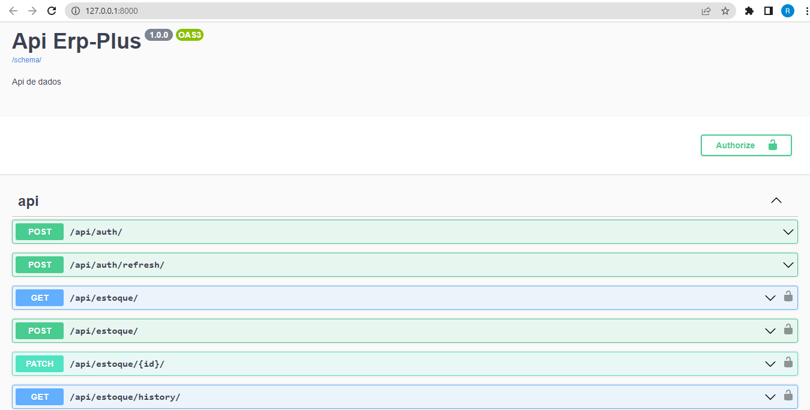

# Erp_plus_back_end
 APIs Rest criando com Django-rest-framework, e utilizado o sqlite para controles de acessos e mongodb para inserção dos dados.


# Utilize os comandos abaixo para executar a aplicação:
```
git clone https://github.com/RailsonPinheiro2030/Erp_plus_back_end
cd Erp_plus_back_end
git checkout almost_perfect
virtualenv venv
venv\Scripts\activate
pip install -r requirements.txt
```

# Como executar essa aplicação?
```
python manage.py makemigrations > o nome do app
python manage.py migration
python manage.py runserver
```

A aplicação deverá estar disponivel em seu navegador no endereço: http://localhost:8000/



# Autenticação

A autenticação e feita através do Simple-JWT.


